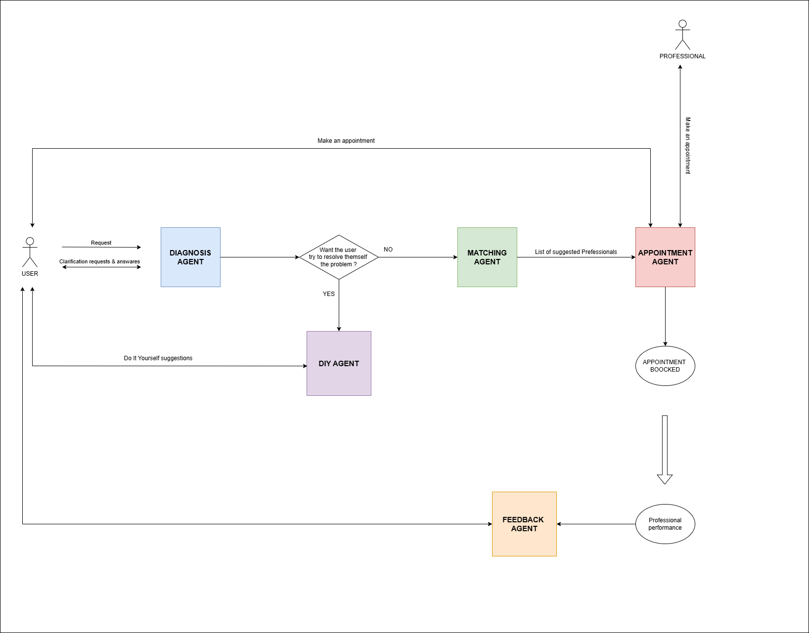

    <h1 align="center">Home Repair Assistant</h1>
    

    Project for Designing Large Scale AI Systems   @ University of Trento A.Y.2024/2025
    

    

      Group B  
      A. De Vidi, M. Grisenti, M. Prosperi,   G. Vazzoler, C. Zamuner  
    
   

----------

 
  <b> AI-based assistant for managing home problems and connecting with professionals. </b>    
  The system combines AI-driven diagnosis and automated data collection to create an efficient bridge between users in distress and qualified professionals, eliminating manual steps in research.  

  <ul>
  <li> It does not replace the technician, but diagnoses the problem, finds the most suitable professional and facilitates contact. 
  <li> It integrates NLP (natural language processing) and machine learning to analyze user requests.
  </ul>

 

----------

  <h3 align='center'> WHAT IT DOES, HOW IT HELPS </h3>
  
 <b> For users: </b> <ul> 
    <li> Saves time in searching for reliable professionals.
    <li> Preliminary diagnosis of the problem to avoid unnecessary interventions.
    <li> Comparison of professionals (reviews, rates, availability, word of mouth).
  </ul>

  
 <b> For professionals: </b> <ul>
    <li>Access to profiled clients with clear needs.
    <li>Reduced communication time through detailed descriptions of the problem. 
  </ul> 
 

---
## Agents
- 🛠️ **[Diagnosis Agent](https://github.com/marcopros/dlsais-project/blob/main/diagnosis_agent)**: Based on the user's input, it identifies the type of problem and suggests a possible DIY solution if the user prefers. Otherwise, it forwards the task to the next agent.
- 🧰 **DIY Agent**: Empowers users to solve problems independently by offering clear, step-by-step instructions, recommended tools and materials, safety precautions, and curated multimedia resources. 
- 🧩 **Matching Agent**: Searches for a professional to address the user's issue, considering factors such as the user's trust network (Network of Trust), location, past interventions, and personal preferences.
- 📅 **Appointment Agent**: Facilitates contact between the user and the selected professional, and, when possible, manages the scheduling of the appointment.
- 🗣️ **Feedback Agent**: Gathers user feedback to update and improve the Network of Trust.

 

  

 

## Requirements --> **[Doc link](https://docs.google.com/document/d/1h5aTDhGsE6GPwdTVpKwTkm87zcH38Ci-F5FXBIQbkOs/edit?usp=sharing)**

## Architecture --> **[Flowchart link](https://drive.google.com/file/d/1gcKNvieO_fnmZ8s8xKSWcWuYHjZWNs5s/view?usp=sharing)** | **[Doc link](https://docs.google.com/document/d/156_QKwj74Sz2SoJMdNFXA3mDP4FXiTqmRkL6dN-Yjt4/edit?usp=sharing)**

## Demo --> https://68954dc0-8046-481d-85e9-6c625c1f8fa6-00-1bb37ej942scl.janeway.replit.dev/auth
