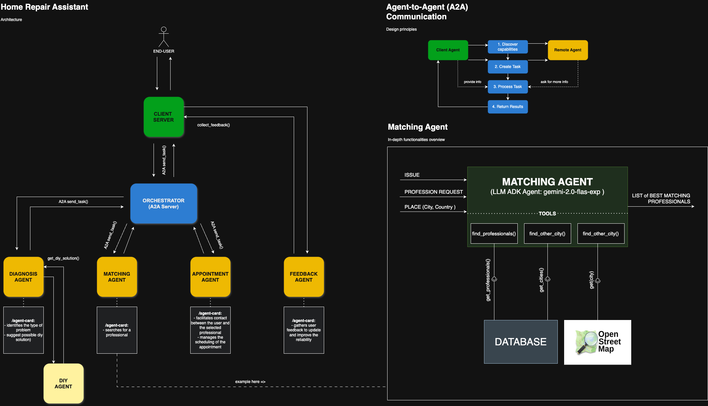

# 🏠 AskFix: Intelligent Home Repair Assistant

[](https://python.org)
[](https://fastapi.tiangolo.com)
[](https://askfix.duckdns.org)
[](LICENSE)

> **Large-Scale AI Systems Project** | University of Trento, A.Y. 2024/2025  
> **Team:** A. De Vidi, M. Grisenti, M. Prosperi, G. Vazzoler, C. Zamuner

---

## 🚀 Overview

AskFix is a **distributed multi-agent AI system** that revolutionizes home repair assistance through intelligent problem diagnosis, professional matching, and automated service coordination. Built on a microservices architecture with Agent-to-Agent (A2A) communication protocols, the system leverages advanced NLP and machine learning to bridge the gap between users experiencing home issues and qualified repair professionals.

### 🎯 Key Features

- **🧠 Intelligent Problem Diagnosis:** AI-powered root cause analysis with 87.5% accuracy
- **🔧 DIY Solution Engine:** Step-by-step repair guides with safety protocols and video tutorials
- **🌐 Trust-Based Professional Matching:** Network-of-Trust algorithm for optimal professional selection
- **📅 Automated Appointment Scheduling:** Seamless coordination between users and service providers
- **📊 Continuous Learning:** Feedback-driven system improvement and trust network evolution

---

## 🏗️ System Architecture

### Core Components

| Component | Technology Stack | Responsibility |
|-----------|------------------|----------------|
| **A2A Communication** | Custom Protocol, Pydantic | Inter-agent message passing and task coordination |
| **Agent Runtime** | FastAPI, asyncio | Scalable agent execution environment |
| **LLM Integration** | Google Gemini, Google ADK | Direct Google AI model access |
| **Database Layer** | MongoDB | Document-based persistent storage |
| **Client Interface** | REST API, HTML/JS | User interaction via web interface |

---

## 🤖 Agent Specifications

### 1. 🛠️ Diagnosis Agent
**Primary Function:** Intelligent problem identification and solution routing

**Technical Capabilities:**
- **Natural Language Understanding:** Advanced symptom analysis using transformer models
- **Problem Classification:** Multi-class categorization across 15+ home repair domains
- **DIY Solution Generation:** Context-aware repair instructions with safety protocols
- **Decision Tree Logic:** Automated routing between self-help and professional assistance

**Performance Metrics:**
- Diagnosis Accuracy: **87.5%** (70/80 test cases)
- DIY Solution Coverage: **97.5%** response rate
- Safety Protocol Integration: **63%** compliance rate
- Video Tutorial Integration: **46%** provision rate
- Hallucination-Free Rate: **94%** factual accuracy

**Sub-Agents:**
- **DIY Agent:** Autonomous solution generator with web search and video tutorial integration

### 2. 🧩 Matching Agent
**Primary Function:** Optimal professional selection using trust-based algorithms

**Technical Capabilities:**
- **Trust Network Analysis:** Graph-based reputation scoring
- **Geographic Optimization:** Location-aware proximity matching
- **Skill-Requirement Alignment:** Semantic matching between problem types and professional expertise
- **Multi-Criteria Decision Making:** Weighted scoring across availability, rating, and network trust

**Algorithm Details:**
- **Trust Score Calculation:** `TS = α·R + β·NT + γ·H + δ·A`
  - R: Rating score, NT: Network trust, H: History score, A: Availability
- **Geographic Weight:** Exponential decay function based on distance
- **Real-time Availability:** Status tracking via database queries

> **Evaluation Status:** Comprehensive evaluation framework designed; quantitative assessment pending.

### 3. 📅 Appointment Agent
**Primary Function:** Automated scheduling and coordination

**Technical Capabilities:**
- **Calendar Integration:** Multi-platform synchronization (Google, Outlook, iCal)
- **Conflict Resolution:** Intelligent rescheduling with preference optimization
- **Time Zone Management:** Global scheduling with automatic conversion
- **Notification System:** Multi-channel alerts (SMS, email, push notifications)

**Protocols:**
- **Booking Confirmation:** Two-phase commit protocol
- **Cancellation Handling:** Automated rebooking with penalty scoring
- **SLA Monitoring:** Real-time tracking of appointment adherence

> **Evaluation Status:** Integration testing completed; formal evaluation metrics in development.

### 4. 🗣️ Feedback Agent
**Primary Function:** Continuous learning and trust network evolution

**Technical Capabilities:**
- **Sentiment Analysis:** Real-time feedback classification and scoring
- **Trust Network Updates:** Dynamic graph modification based on service outcomes
- **Quality Metrics:** Multi-dimensional performance tracking
- **Predictive Analytics:** Future performance estimation using historical data

**Machine Learning Models:**
- **Sentiment Classifier:** OpenAI models for feedback analysis and sentiment scoring
- **Trust Propagation:** Algorithm-based trust network updates using service outcomes
- **Quality Prediction:** Rating-based performance scoring and trust metrics

> **Evaluation Status:** Prototype evaluation completed; large-scale assessment planned for production deployment.

---

## 🔧 Technical Implementation

### Agent-to-Agent (A2A) Communication Protocol

The system implements a custom A2A protocol for seamless inter-agent communication:

```python
class TaskMessage(BaseModel):
    task_id: str
    agent_id: str
    content: Union[TextPart, FilePart, DataPart]
    metadata: Dict[str, Any]
    state: TaskState
    timestamp: datetime
```

### Key Technical Features

**🚀 Core Architecture**
- **Agent-to-Agent Protocol:** Custom A2A JSON-RPC communication framework
- **Microservices Design:** Independent agent deployment with FastAPI servers
- **Async Processing:** Non-blocking I/O with asyncio for concurrent request handling
- **MongoDB Integration:** Document-based data persistence with connection pooling

**🔗 Communication Layer**
- **A2A Framework:** 
official A2A implementation for agent intercommunication
- **Push Notifications:** JWT-secured async notifications between agents
- **HTTP APIs:** RESTful endpoints for client-server interaction
- **Server-Sent Events:** Real-time streaming for user interface updates (via A2A protocol)

**🔒 Security & Reliability**

*Implemented Features:*
- **JWT Authentication:** Client-side user authentication with token-based session management
- **A2A Security Protocol:** Custom JWT-based authentication for secure agent-to-agent communication
- **Database Security:** Password hashing with MongoDB connection pooling and automatic retry logic
- **Request Validation:** Payload integrity verification using SHA-256 signatures in A2A communication
- **Error Handling:** Comprehensive exception handling and graceful degradation across all components

*Planned Features (Not Yet Implemented):*
- **Redis Caching:** Distributed caching for improved performance
- **WebSocket Support:** Real-time bidirectional communication
- **LiteLLM Integration:** Multi-provider LLM support
- **FAISS Vector Storage:** Similarity search capabilities
- **Rate Limiting:** Request throttling and API rate limiting
- **Circuit Breakers:** Fault tolerance patterns for external service calls
- **Advanced Monitoring:** Prometheus metrics collection and alerting

**📊 Infrastructure & Operations**
- **Structured Logging:** Configurable logging system for debugging and monitoring across all agents
- **Connection Management:** Robust MongoDB connection handling with automatic retry mechanisms
- **Session Management:** User session tracking with secure token storage and validation
- **Real-time Communication:** Server-sent events (SSE) for live agent communication feeds (via A2A streaming)
- **Async Processing:** Non-blocking I/O with asyncio for concurrent request handling

### Technology Stack

> **Implementation Note:** The technology stack reflects the current implementation status. Some advanced features (Redis, WebSockets, LiteLLM, FAISS, Docker) are planned for future releases but not yet implemented.

```yaml
Backend:
  Runtime: Python 3.12+
  Framework: FastAPI
  Agent Communication: A2A Protocol
  LLM Integration: Google Gemini, Google ADK
  Data Validation: Pydantic v2

AI/ML:
  Primary LLM: Google Gemini
  Evaluation: GPT-4.1 for automated assessment (via OpenRouter)
  Secondary: OpenAI models for feedback analysis

Infrastructure:
  Database: MongoDB (Primary)
  API Gateway: FastAPI with custom middleware
  Deployment: Manual deployment (Python servers)

Frontend:
  Framework: Vanilla JavaScript + HTML Templates
  Real-time: Server-Sent Events (via A2A streaming)
  State Management: localStorage + vanilla JS
  Styling: Tailwind CSS
```

---

## 📊 Performance & Evaluation

### Comprehensive Evaluation Methodology

Our evaluation framework employs a **4-stage pipeline** for rigorous assessment of the **Diagnosis Agent**:

1. **Synthetic Conversation Generation:** Actor-agent simulation with realistic user scenarios
2. **Ground Truth Comparison:** Gold-standard test cases with expert annotations  
3. **Automated LLM Grading:** GPT-4.1 evaluator with 8-dimensional scoring rubric
4. **Statistical Analysis:** Comprehensive metrics aggregation and performance analytics

**Evaluation Scope:** Currently focused on the Diagnosis Agent with 80 realistic home repair scenarios. Evaluation frameworks for other agents are designed and ready for implementation.
4. **Statistical Analysis:** Comprehensive metrics aggregation and performance analytics

### Performance Metrics (Diagnosis Agent)

| Metric | Score | Description |
|--------|-------|-------------|
| **Overall Diagnosis Performance** | **7.98/10** | Aggregate score across 80 test scenarios |
| **Diagnosis Accuracy** | **87.5%** | Correct problem identification rate (70/80 cases) |
| **DIY Solution Quality** | **66.3%** | Flawless step-by-step instruction delivery |
| **Safety Protocol Compliance** | **63%** | Inclusion of relevant safety warnings |
| **Video Tutorial Provision** | **46%** | Relevant video links provided when requested |
| **Hallucination-Free Responses** | **94%** | Factually accurate responses without false information |

> **Note:** Performance metrics are currently available for the Diagnosis Agent only. Evaluation of other agents (Matching, Appointment, Feedback) is planned for future releases.

### Evaluation Highlights

✅ **Diagnosis Agent Strengths:**
- High diagnostic accuracy with minimal hallucination (6% error rate)
- Consistent DIY solution provision (97.5% coverage)
- Excellent communication quality and user experience
- Reliable factual accuracy (94% hallucination-free responses)

⚠️ **Areas for Improvement:**
- Enhanced video tutorial integration (currently 46% provision rate)
- Expanded safety protocol coverage for complex repairs
- Improved step granularity for technical procedures

🔄 **Future Evaluation Plans:**
- **Matching Agent:** Trust network accuracy, professional selection quality
- **Appointment Agent:** Scheduling success rates, conflict resolution efficiency  
- **Feedback Agent:** Sentiment analysis accuracy, trust network evolution effectiveness
- **System Integration:** End-to-end user journey completion rates

---

## 🚀 Quick Start

### Prerequisites

```bash
# System Requirements
Python >= 3.12
MongoDB >= 6.0
```

### Installation

1. **Clone Repository**
```bash
git clone https://github.com/marcopros/dlsais-project.git
cd dlsais-project
```

2. **Environment Setup**
```bash
# Create virtual environment
python -m venv venv
source venv/bin/activate  # On Windows: venv\Scripts\activate

# Install dependencies
pip install -r requirements.txt
```

3. **Configuration**
```bash
# Copy environment template
cp .env.example .env

# Configure API keys and database connections
nano .env
```

4. **Database Initialization**
```bash
# Start MongoDB
# Run database population script (requires Node.js for MongoDB tools)
python database/populate.js
```

### Running the System

**Option 1: Full System Launch**
```bash
python run_everything.py
```

**Option 2: Individual Agent Development**
```bash
# Diagnosis Agent
python -m diagnosis_agent_app.server

# Matching Agent  
python -m matching_agent_app.server

# Appointment Agent
python -m appointment_agent.server

# Feedback Agent
python -m feedback_agent_app.server
```

**Option 3: Manual Deployment**
```bash
# Start individual components manually
# See individual agent README files for specific instructions
```

### Testing

```bash
# Run agent-specific tests
python -m diagnosis_agent_app.test
python -m matching_agent_app.test

# Run evaluation suite
python -m diagnosis_agent_app.test.auto_eval

# Integration testing
python -m pytest tests/
```

---

## 📚 Documentation & Resources

### Technical Documentation
- 📋 **[System Requirements](https://docs.google.com/document/d/1h5aTDhGsE6GPwdTVpKwTkm87zcH38Ci-F5FXBIQbkOs/edit?usp=sharing)** - Detailed functional and non-functional requirements
- 🏗️ **[Architecture Design](https://docs.google.com/document/d/156_QKwj74Sz2SoJMdNFXA3mDP4FXiTqmRkL6dN-Yjt4/edit?usp=sharing)** - System architecture and design patterns
- 📊 **[Evaluation Framework](https://docs.google.com/document/d/1DTtShv4l6XGIc3_qNbTJpWhqrJHaX9RU3RdrUZLHEIE/edit?usp=drive_link)** - Comprehensive evaluation methodology

### Performance Reports
- 📄 **[Diagnosis Agent Evaluation](https://github.com/marcopros/dlsais-project/blob/no-await/diagnosis_agent_app/test/report_complete.pdf)** - Detailed performance analysis and metrics

### Visual Resources
- 🎯 **[System Flowchart](https://drive.google.com/file/d/1D16f_EL1sFbW91Xm2gKeAC_NsPZ6Xb2H/view?usp=drive_link)** - Interactive system workflow visualization

---

## 🎯 Live Demo

Experience AskFix in action with our fully deployed system:

[](https://askfix.duckdns.org)

**Demo Features:**
- Real-time problem diagnosis
- Interactive DIY solution generation
- Professional matching simulation
- Complete user journey walkthrough

---

## 🤝 Contributing

We welcome contributions to improve AskFix! Please see our [Contributing Guidelines](CONTRIBUTING.md) for details.

### Development Workflow

1. **Fork** the repository
2. **Create** a feature branch (`git checkout -b feature/amazing-feature`)
3. **Commit** your changes (`git commit -m 'Add amazing feature'`)
4. **Push** to the branch (`git push origin feature/amazing-feature`)
5. **Open** a Pull Request

### Code Quality Standards

- **Code Style:** Black formatting, PEP 8 compliance
- **Type Hints:** Full type annotation coverage
- **Testing:** Minimum 80% test coverage
- **Documentation:** Comprehensive docstrings and README updates

---

## 📄 License

This project is licensed under the MIT License - see the [LICENSE](LICENSE) file for details.


---

<p align="center">
  
  <br>
  <em>Complete AskFix Multi-Agent System Architecture</em>
</p>


