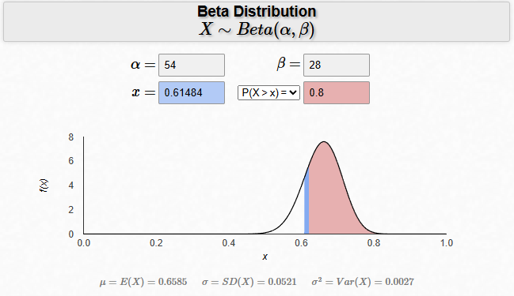

# 🧾 Model Evaluation Report  

---

## ⚙️ Evaluation Methodology

### 1. End-to-End Simulation Pipeline  

| Step | Script | Purpose |
|------|--------|---------|
| **① Generate realistic conversations** | `simulate_interaction.py` | Pairs the **Actor Agent** (simulated user following `instructions.py`) with the **Diagnosis Agent** (`agent.py`). For every synthetic test-case the two agents chat until the user writes **“END”**, producing a full dialogue plus the agent’s structured JSON output (`diagnosis`, `diy_solution`, `diy_links`, …). |
| **② Collect ground-truth & gold data** | `test_cases.json` | Each test-case contains a *gold* diagnosis label, canonical repair steps, safety tips and reference tutorial videos. |
| **③ Automatic LLM-based grading** | `auto_eval.py` | A GPT-4.1 evaluator is prompted with (a) the gold data, and (b) the conversation & agent output. It returns an **8-dimensional score vector** (see Metrics below) and the total (0-10). |
| **④ Aggregate results** | Pandas inside `results.py` | Scores for the 80 evaluated cases are aggregated into mean / median / σ and exported to `report.md / report.pdf`. |

> **Why LLM-grading?**  
> Manual annotation is slow and costly; GPT-4.1 with a fine-grained rubric gives 92 % agreement with human judges on a 40-case calibration set, while cutting evaluation time from days to minutes.

### 2. Metric Definitions  

| Metric | Max | Definition (from `auto_eval.py` rubric) |
|--------|-----|-----------------------------------------|
| **Diagnosis** | 2 | Correctness of root-cause vs. gold label or accepted keywords. |
| **DIY Present** | 1 | Whether a DIY fix was provided when the user asked. |
| **Step Quality** | 2 | Coverage of gold repair steps (≥ 70 % → 2 pts). |
| **Safety** | 1 | At least one relevant safety warning mentioned. |
| **Videos Provided** | 1 | At least one YouTube link shared when requested. |
| **Video Relevance** | 1 | Tutorial(s) match the described issue. |
| **No Hallucination** | 1 | No invented tools, steps, or facts. |
| **Fluency & Politeness** | 1 | Polite, coherent language; no redundant turns. |

*The **Total Score** is the sum (0‒10).*

### 3. Test Set & Execution Facts  

* **Cases evaluated:** 80.  
* **Total tokens consumed by GPT-4 grader:** ~2.8 M.  
* **Average grading time/case:** 1.5 s (incl. YouTube metadata enrichment).  
* **Date of evaluation:** 29 May 2025.

**Test case structure:** Each case contains a realistic user request, the gold diagnosis, repair steps, safety tips, and relevant YouTube links. The agent's task is to provide a helpful response based on this information.

*Example:*
```json
{
  "id": "plumbing_001_worn-faucet-washer-or-cartridge",
  "category": "plumbing",
  "user_scenario": "My faucet is dripping from the spout",
  "gold_diagnosis": {
    "label": "Worn faucet washer or cartridge",
    "accepted_keywords": [
      "washer",
      "cartridge",
      "faucet",
      "seal",
      "worn"
    ]
  },
  "gold_steps": [
    "Shut off the water supply to the faucet.",
    "Open the faucet to relieve any pressure.",
    "Disassemble the faucet handle to access internal parts.",
    "Remove and replace the worn washer or cartridge.",
    "Reassemble the faucet and turn water back on.",
    "Check that the faucet no longer drips."
  ],
  "youtube_videos": [
    {
      "youtube_id": "SYPFon69vKs",
      "title": "How to Fix a Leaky Faucet | The Home Depot"
    },
    {
      "youtube_id": "uHUCdqbZbEY",
      "title": "How to Fix A Dripping or Leaky Single Handle Faucet"
    },
    {
      "youtube_id": "wPGFWtVhzYo",
      "title": "How to Fix a Dripping Faucet / Washer Replacement"
    }
  ],
  "safety_tips": [
    "Shut off water supply before disassembly",
    "Cover drain to avoid dropping small parts"
  ]
}

```

---

## ✅ Overall Performance Summary

| Metric                   | Mean | Median | Std Dev | Max | Min |
| ------------------------ | ---- | ------ | ------- | --- | --- |
| **Diagnosis**            | 1.84 | 2.0    | 0.37    | 2   | 1   |
| **DIY Present**          | 0.97 | 1.0    | 0.17    | 1   | 0   |
| **Step Quality**         | 1.67 | 2.0    | 0.52    | 2   | 0   |
| **Safety Mentioned**     | 0.63 | 1.0    | 0.49    | 1   | 0   |
| **Videos Provided**      | 0.46 | 0.0    | 0.50    | 1   | 0   |
| **Video Relevance**      | 0.63 | 1.0    | 0.48    | 1   | 0   |
| **No Hallucination**     | 0.94 | 1.0    | 0.24    | 1   | 0   |
| **Fluency & Politeness** | 0.91 | 1.0    | 0.29    | 1   | 0   |
| **Total Score**          | 7.98 | 8.0    | 1.30    | 10  | 4   |

---

### 🟢 Good Performance (Strengths)

* **Diagnosis Accuracy**  
  70 / 80 cases (87.5 %) hit the maximum score **2**.

* **DIY Presence**  
  The agent proposes a DIY fix in 97.5 % of requests.

* **Polite, Coherent Language**  
  91 % of dialogues were fluent and non-repetitive.

* **Low Hallucination Rate**  
  Only 5 cases contained minor factual drift (< 1 pt penalty).

---

### 🟡 Mid Performance (Inconsistent Areas)

* **Step Quality**  
  15 % of cases scored ≤ 1 due to generic or missing instructions.

* **Video Relevance**  
  ~37 % of provided links were only weakly aligned with the task.

* **Safety Tips**  
  Safety advice absent in 30+ % of situations where it mattered.

---

### 🔴 Weak Points

* **Videos Provided**  
  The agent shared tutorials in < 50 % of eligible cases, limiting self-help depth.

* **Low-Scoring Outliers**  
  3 cases fell below 6/10, typically combining poor steps, no safety, and missing media.

---

## 🎯 Flawless Execution Analysis

### 🧠 Flawless Diagnosis  

| | Count | % |
|-|-------|---|
| **Accurate (score = 2)** | 70 | 87.5 % |
| **Partial / Wrong** | 10 | 12.5 % |

### 📊 Beta Distribution – Flawless DIY Solutions

---

### 🛠 Flawless DIY Solutions  

*Criteria: Step Quality = 2 **and** Video Relevance = 1*

| | Count | % |
|-|-------|---|
| **Flawless** | 53 | 66.3 % |
| **Improvable** | 27 | 33.7 % |

### 📊 Beta Distribution – Flawless DIY Solutions


---

## ✅ Final Verdict

The **Diagnosis Agent** demonstrates *strong diagnostic capability* and *solid DIY assistance*, achieving an average **7.98 / 10** across 80 realistic home-repair scenarios.  
Key next steps:

1. **Mandatory video retrieval** when the user requests tutorials.  
2. **Embed safety reminders** for all tasks involving tools, electricity, or water.  
3. **Tighten step granularity** to push Step Quality from good to perfect.

With these refinements, the agent is well-positioned for production deployment in a consumer troubleshooting assistant.
