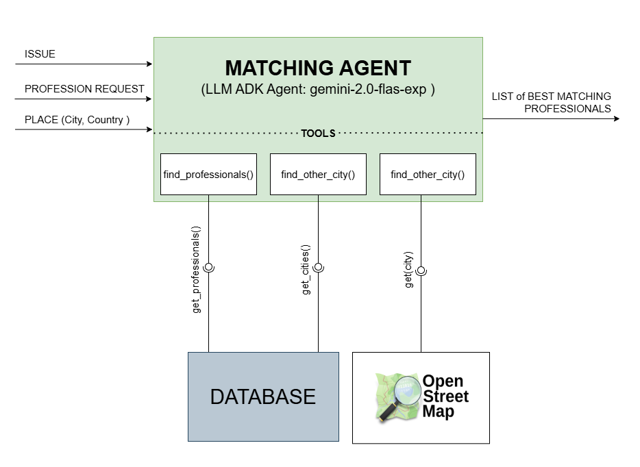

# 🧩 **Matching Agent**
The Matching Agent is a smart assistant designed to connect users with the best professionals based on their specific needs. Whether you need an electrician, plumber, or other professionals, the agent helps find the most qualified individuals to address your issue, ensuring they are located in your area or nearby cities.

 

  

 

 
 

## Tools
The Matching Agent uses the following tools to provide its service:
<ol>
<li><b><em>find_professionals()</em></b>: Finds available professionals based on the profession, issue, and location.</li>

<li><b><em>find_other_city()</em></b>: Helps locate other cities where the requested profession is available if no professionals are found in the specified location.</li>

<li><b><em>find_nearest_cities()</em></b>: Identifies nearby cities to expand the search using OpenStreetMap API for professionals if needed.</li>
</ol>
 
 

## Workflow Overview
<ol>
<li><b>User Input Analysis</b>
The agent begins by extracting key information from the user's request. This includes:
<ul> 

<li><b>Profession</b>: The type of professional the user is looking for (e.g., electrician, plumber).

<li><b>Issue</b>: The specific problem or service required (e.g., "fix a broken pipe").

<li><b>Location</b>: The city or area where the user needs the service.
</li>
</ul>
 
<li><b>Initial Search for Professionals</b>
Using the extracted profession, issue, and location, the agent queries the <em> find_professionals()</em> tool to identify relevant professionals. If professionals are found, the agent proceeds to select the best matches based on skills and ratings (point 5)
</li>
 

<li><b>Handling No Matches Found</b>
If no professionals are found in the user's specified location:
<ul>
<li>
The agent use the <em>find_other_city()</em> tool to search for nearby cities where the requested profession is available.
</li>
<li>
The agent will also use the <em>find_nearest_cities()</em> tool to find the nearest city to the user's location.
</li>
</ul>
 
<li><b>Second Search in Nearby City</b>
After identifying the nearest city, the agent will repeat the search for professionals using the new city. If successful, the agent presents professionals from the nearby city.
</li>
 
<li><b>Selection of Professionals</b>
Once a list of professionals is returned, the agent will select up to 5 professionals, ensuring that at least 2 are available. Prioritize professionals based on:
<ul>
<li>Relevance to the specific issue.</li>
<li>Higher ratings to ensure quality service.</li>
</ul>
</li>
 

<li><b>Presentation of Results</b>
The agent presents the selected professionals to the user in a clear and concise manner.
</li>

</ol>
