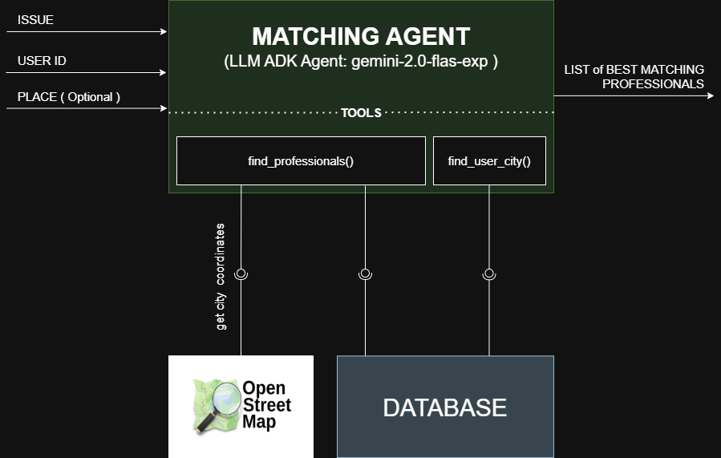
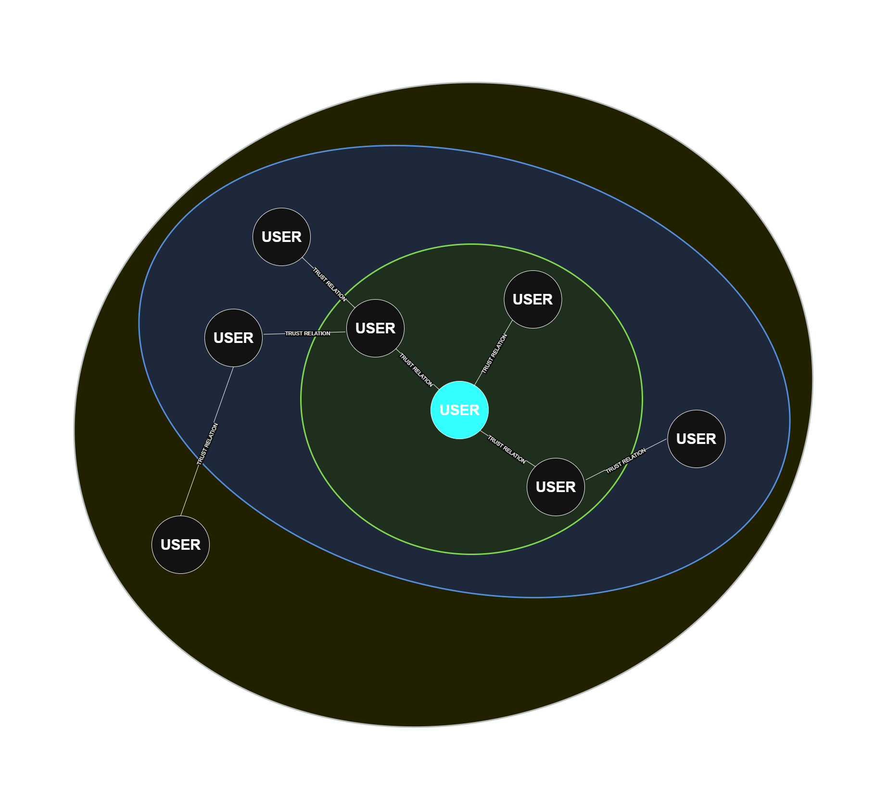

# 🧩 **Matching Agent**

The Matching Agent is a smart assistant designed to connect users with the best professionals based on their specific needs. Whether you need an electrician, plumber, or other professionals, the agent helps find the most qualified individuals to address your issue, ensuring they are located in your area or nearby cities.

 

  

 

 
 

## Tools

The Matching Agent uses the following tools to provide its service:

<ol>
<li><b><em>find_professionals()</em></b>: Finds professionals based on a specified profession and city. If no direct matches are found, it gracefully falls back to searching in nearby cities or lists alternative professions available in the same city. It also enriches results with trust network insights , showing which professionals are trusted by the user or by other trusted users.</li>

<li><b><em>get_user_city()</em></b>: Retrieves the city associated with a given user ID. This tool can be used to determine a user's location for personalized searches or recommendations.</li>
</ol>
 
 

## Agent

<b>Input:</b>
The agent receives:
<ul>
  <li> A problem diagnosis (e.g., "My sink is leaking").
  <li> A user_id (used to retrieve city and trust network).
  <li> Optionally, a city name (if the user want to find professionals in other cities).
</ul>

 
<b>Workflow:</b>
<ol> 
<b>NB: </b> If the city is not provided the agent use the get_user_city tool to retrieve the user's city from the database.
</li>

 

<li><b>Infer Profession Type</b>
Understand the diagnosis to infer the most relevant profession category (e.g., electrician, plumber, etc.)
</li>

 

<li><b>Infer Required Skills</b>
 Extract the key required skills from the diagnosis (e.g., "power outage" → "electrical systems").
</li>

 

<li><b>Find Professionals</b>
Use find_professionals tool to search in the given city using the inferred profession and user_id. 
The tool can return 3 type of response:

<ul>
  <li>status == "success": the tool have found and return all the professionals for the requested profession and city</li>
  <li>status == "cities_found": the tool have not found some professionals for the requested profession in the requested city. So it return a list of the nearest city where that type of profession are founded in the database</li>
  <li>status == "alternate_found": the tool have not found any cities where there is the requested type of profession, so it return a list of alternative professionals available in the requested city</li>
  <li>status == "error": the tool have not found any professionist in the city, so it inform the user that no professionals were found and suggest trying a different profession or refining the diagnosis.</li>
</ul>
</li>

 

<li><b>Rank Professionals</b>
Rank the professionals by trust_by_you (best if true), trust_by (better if long), trusted score and skill match. It return the **top 5** professionals
</li>

 

<li><b>Format Response</b>
The agent response always include a concise summary message. Alongside it provide also the professional results like a list of dictionary, where each dictionary is a professional:
  <ul style="list-style-type: '- '">
    <li>name (string)</li>
    <li>skills (list of strings)</li>
    <li>rating (float)</li>
    <li>city (string)</li>
    <li>_id (string)</li>
    <li>trust_by_you (boolean)</li>
    <li>trust_by (list of string)</li>
  </ul>   
</li>

</ol>
 
 

## Task Menager
<b>Input:</b>
The Task Menager take in input a paylod of a fetch request, it should have this structure:
<ul style="list-style-type: '- '">
  <li> "id": task_id, </li>
  <li> "sessionId": session_id, </li>
  <li> "acceptedOutputModes": ["text"], </li>
  <li> "message": 
    <ul style="list-style-type: '- '">  
      <li> "role": "user",
      <li> "parts": [ {"type": "text", "text": user_text} ],
      <li> "id": str(uuid.uuid4()), "timestamp": int(datetime.now().timestamp() * 1000),
    </ul>
  </li>
  <li> "metadata": { "user_id": user_id, }</li>
</ul>

 
<b>Workflow:</b>
<ol> 
<li><b>Create the Task</b>
Create the Task and store it in to the session menager
</li>

 

<li><b>Prepare the Query</b>
Extract the query of the user from the and append the 'user_id' from the metadata field.
</li>

 

<li><b>Invoke the Agent</b>
Send the query to the agent and wait it respons
</li>

 

<li><b>Format Respons</b>
Define an A2A Message containing an A2A TextPart:
<ul>
  <li><b>text</b>: summary coming from the agent (TextPart)</li>
  <li><b>metadata</b>: professional filed containing all the data of the professionals founded by the agent</li>
</ul>
</li>
        

## TRUST NETWORK
The trust network operates by enriching a list of professionals with trust information derived from the connections of trusted users. For each professional, the system determines:
<ul>
  <li> if the current user trusts them directly, based on their own list of trusted professionals. </li> 
  Additionally, 
  <li> if the users, trusted by the current user, trust the professional based on their own list of trusted professionals.  </li>
</ul>

 

  

 

<b>NB</b> Until now we are considering only the trust relation of the first order. In the futur should be improved the system in order to consider also the trust relation of bigger order
